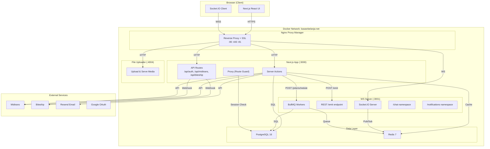
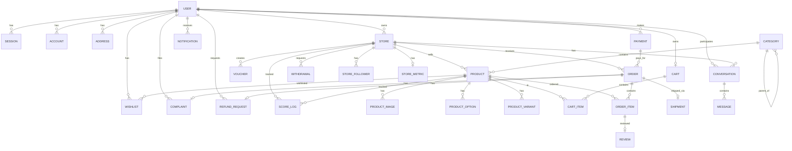
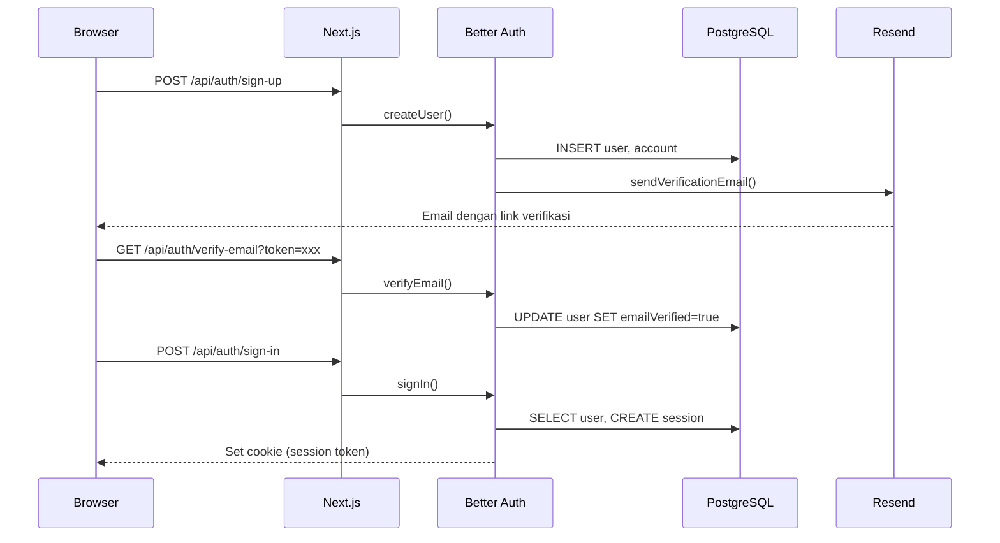
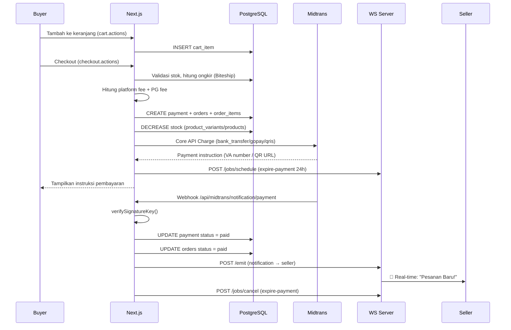
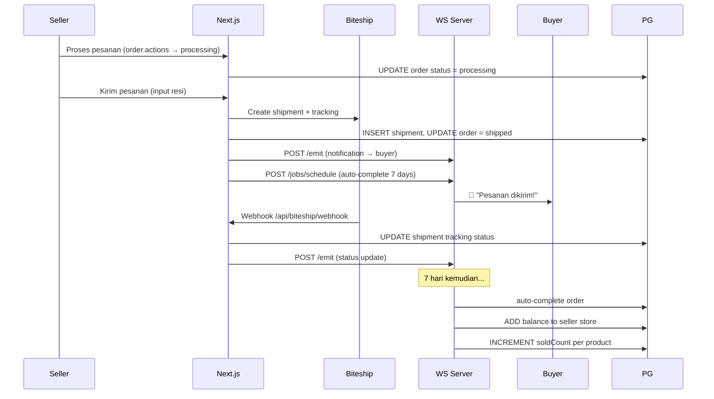
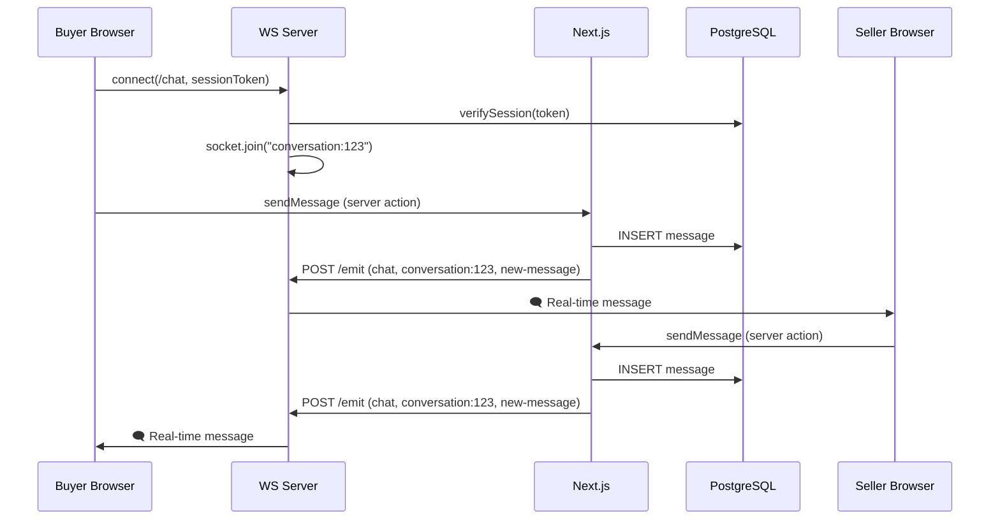

# 🛒 KawanBelanja (KiriMart) — Dokumentasi Lengkap Aplikasi

> Analisis mendalam dari luar hingga dalam, mencakup arsitektur, alur kerja, database, integrasi, dan deployment.

---

## 1. Identitas Aplikasi

| Item | Detail |
|---|---|
| **Nama** | KawanBelanja (internal: KiriMart / `kawanbelanja`) |
| **Tipe** | Marketplace E-Commerce Multi-Seller |
| **Domain Produksi** | `kawanbelanja.com` |
| **Bahasa Utama** | Indonesia (UI + komentar kode) |
| **Package Name** | `kawanbelanja` (di [package.json](file:///c:/Putra/Ngoding%20AntiGravity/set-ecomerce/kirimart/package.json)) |

---

## 2. Tech Stack Lengkap

### Frontend
| Teknologi | Versi | Kegunaan |
|---|---|---|
| **Next.js** | 16.2.4 | Framework fullstack (App Router) |
| **React** | 19.2.4 | UI Library |
| **Tailwind CSS** | v4 | Styling utility |
| **shadcn/ui** | v4.7.0 (radix-nova) | Component library |
| **TanStack React Query** | v5 | Server state management + caching |
| **Recharts** | 3.8.0 | Charting/analytics |
| **React Leaflet** | 5.0 | Peta interaktif (alamat) |
| **Embla Carousel** | 8.6 | Carousel produk |
| **Sonner** | 2.0.7 | Toast notifications |
| **cmdk** | 1.1.1 | Command palette / search |
| **Serwist** | 9.5.11 | PWA / Service Worker |
| **Socket.IO Client** | 4.8.3 | Real-time WebSocket |
| **next-themes** | 0.4.6 | Dark/Light mode |

### Backend (Dalam Next.js)
| Teknologi | Kegunaan |
|---|---|
| **Next.js Server Actions** | Logika bisnis utama |
| **Better Auth** | v1.6.9 — Autentikasi (email+password, Google OAuth, Email OTP) |
| **Drizzle ORM** | v0.45.2 — Database ORM (PostgreSQL) |
| **Zod** | v4.4.3 — Validasi schema |
| **@t3-oss/env-nextjs** | Type-safe environment variables |
| **ioredis** | Redis client (cache layer) |
| **Resend** | Email transaksional (verifikasi, reset password) |

### Infrastruktur
| Teknologi | Kegunaan |
|---|---|
| **PostgreSQL 16** | Database utama |
| **Redis 7** | Cache, BullMQ queue, Socket.IO adapter |
| **Docker** | Containerisasi semua service |
| **Nginx Proxy Manager** | Reverse proxy + SSL |
| **Bun** | Package manager + runtime |

### Integrasi Pihak Ketiga
| Service | Kegunaan |
|---|---|
| **Midtrans** | Payment gateway (VA, GoPay, ShopeePay, QRIS) |
| **Biteship** | Logistik/kurir (JNE, SiCepat, J&T, dll) |
| **Resend** | Email API |
| **Google OAuth** | Social login |
| **Meta Pixel** | Analytics/tracking |

---

## 3. Arsitektur Sistem



---

## 4. Struktur Direktori Lengkap

```
kirimart/
├── 📄 package.json              # Dependencies & scripts
├── 📄 Dockerfile                 # Multi-stage build (deps→builder→runner)
├── 📄 docker-compose.yml         # Development (Redis + WS Server)
├── 📄 docker-compose.prod.yml    # Production (ALL 6 services)
├── 📄 next.config.mjs            # Standalone output + PWA (Serwist)
├── 📄 drizzle.config.js          # Drizzle ORM → PostgreSQL config
├── 📄 components.json            # shadcn/ui config (radix-nova style)
├── 📄 .env / .env.production     # Environment variables
│
├── 📁 src/
│   ├── 📄 proxy.js               # Route guard (menggantikan middleware)
│   │
│   ├── 📁 app/                   # Next.js App Router
│   │   ├── 📄 layout.jsx         # Root layout (fonts, providers, Meta Pixel)
│   │   ├── 📄 globals.css        # Global styles + CSS variables
│   │   ├── 📄 sw.js              # Service Worker (PWA)
│   │   │
│   │   ├── 📁 (auth)/            # Auth pages (public, redirects if logged in)
│   │   │   ├── sign-in/
│   │   │   ├── sign-up/
│   │   │   ├── forgot-password/
│   │   │   └── reset-password/
│   │   │
│   │   ├── 📁 (public)/          # Public marketplace pages
│   │   │   ├── 📄 page.jsx       # Homepage (hero, products)
│   │   │   ├── cart/              # Keranjang belanja
│   │   │   ├── chat/              # Chat buyer↔seller
│   │   │   ├── checkout/          # Proses checkout
│   │   │   ├── katalog/           # Katalog / pencarian
│   │   │   ├── product/           # Detail produk
│   │   │   └── store/             # Halaman toko
│   │   │
│   │   ├── 📁 (protected)/       # Requires login
│   │   │   ├── create-store/      # Form buat toko baru
│   │   │   ├── seller/
│   │   │   ├── seller-registration/
│   │   │   └── user-dashboard/    # Dashboard pembeli
│   │   │
│   │   ├── 📁 admin-dashboard/   # Admin (role: admin)
│   │   │   ├── categories/
│   │   │   ├── products/
│   │   │   ├── stores/
│   │   │   ├── users/
│   │   │   ├── vouchers/
│   │   │   ├── withdrawals/
│   │   │   ├── refunds/
│   │   │   ├── settings/
│   │   │   └── activity-logs/
│   │   │
│   │   ├── 📁 seller-dashboard/  # Seller (role: seller)
│   │   │   ├── products/
│   │   │   ├── orders/
│   │   │   ├── reviews/
│   │   │   ├── vouchers/
│   │   │   ├── store/
│   │   │   ├── finance/
│   │   │   └── activity/
│   │   │
│   │   ├── 📁 api/               # API Route Handlers
│   │   │   ├── auth/[...all]/     # Better Auth catch-all
│   │   │   ├── midtrans/notification/  # Midtrans webhooks
│   │   │   │   ├── payment/       # Payment webhook
│   │   │   │   ├── pay-account/   # Pay account webhook
│   │   │   │   └── recurring/     # Recurring payment webhook
│   │   │   └── biteship/webhook/  # Biteship shipping webhook
│   │   │
│   │   └── 📁 data/              # Data fetching utilities
│   │
│   ├── 📁 actions/               # Server Actions (business logic)
│   │   ├── 📁 public/            # Buyer-facing actions
│   │   │   ├── cart.actions.js
│   │   │   ├── checkout.actions.js
│   │   │   ├── chat.actions.js
│   │   │   ├── payment/
│   │   │   ├── biteship.actions.js
│   │   │   ├── review.actions.js
│   │   │   ├── search.actions.js
│   │   │   ├── storefront.actions.js
│   │   │   ├── tracking.actions.js
│   │   │   ├── notification.actions.js
│   │   │   ├── store-follow.actions.js
│   │   │   └── voucher.actions.js
│   │   │
│   │   ├── 📁 protected/         # Requires auth
│   │   │   ├── seller-registration.actions.js
│   │   │   └── store.actions.js
│   │   │
│   │   ├── 📁 seller-dashboard/  # Seller actions
│   │   │   ├── order.actions.js   # (34KB — terbesar!)
│   │   │   ├── product/
│   │   │   ├── finance.actions.js
│   │   │   ├── review.actions.js
│   │   │   ├── voucher/
│   │   │   ├── score.actions.js
│   │   │   ├── activity-log.actions.js
│   │   │   └── seller.dashboard.actions.js
│   │   │
│   │   ├── 📁 admin-dashboard/   # Admin actions
│   │   │   ├── category/
│   │   │   ├── product/
│   │   │   ├── store/
│   │   │   ├── user/
│   │   │   ├── voucher/
│   │   │   ├── withdrawal.actions.js
│   │   │   ├── refund.actions.js
│   │   │   ├── settings.actions.js
│   │   │   └── activity-log.actions.js
│   │   │
│   │   ├── 📁 user-dashboard/    # Buyer dashboard actions
│   │   │   ├── address.actions.js
│   │   │   ├── order.actions.js
│   │   │   ├── complaint.actions.js
│   │   │   ├── profile.actions.js
│   │   │   └── wishlist.actions.js
│   │   │
│   │   └── 📁 kiriminaja/        # Shipping integration
│   │
│   ├── 📁 features/              # Feature components (UI)
│   │   ├── 📁 public/
│   │   │   ├── navbar.jsx         # (21KB — navigation complex)
│   │   │   ├── hero-section.jsx
│   │   │   ├── footer.jsx
│   │   │   ├── search-bar.jsx
│   │   │   ├── chat-view.jsx      # (28KB — real-time chat UI)
│   │   │   ├── store-view.jsx
│   │   │   ├── cart/
│   │   │   ├── catalog/
│   │   │   ├── checkout/
│   │   │   └── product/
│   │   │
│   │   ├── 📁 seller-dashboard/
│   │   │   ├── dashboard-overview.jsx
│   │   │   ├── order/, product/, finance/
│   │   │   ├── review/, store/, voucher/
│   │   │
│   │   ├── 📁 admin-dashboard/
│   │   │   ├── category/, product/, store/
│   │   │   ├── user/, voucher/, refund/
│   │   │   ├── settings/, withdrawals/
│   │   │
│   │   ├── 📁 user-dashboard/
│   │   │   ├── address/, orders/, profile/, wishlist/
│   │   │
│   │   ├── 📁 create-store/
│   │   │   └── create-store-form.jsx
│   │   │
│   │   └── 📁 seller-registration/
│   │       └── seller-registration-view.jsx
│   │
│   ├── 📁 components/            # Shared components
│   │   ├── 📁 ui/                # shadcn/ui components
│   │   ├── 📁 layout/            # Layout components
│   │   ├── 📁 global/            # Global components
│   │   ├── 📁 shared/            # Reusable components
│   │   ├── 📁 table/             # Data table components
│   │   ├── 📁 analytics/         # Meta Pixel
│   │   └── 📁 public/            # Public page components
│   │
│   ├── 📁 config/
│   │   ├── 📁 env/
│   │   │   └── index.js           # Type-safe env validation (Zod + @t3-oss)
│   │   ├── 📁 db/
│   │   │   ├── index.js           # Drizzle DB connection
│   │   │   ├── schema/            # 28 schema files!
│   │   │   ├── migrations/
│   │   │   ├── seed-platform-settings.js
│   │   │   └── fix-store-balances.js
│   │   └── 📁 constants/
│   │       └── menu.js            # Admin & Seller sidebar menus
│   │
│   ├── 📁 lib/                   # Utility libraries
│   │   ├── auth.js                # Better Auth server config
│   │   ├── auth-client.js         # Better Auth client
│   │   ├── redis.js               # Redis singleton (ioredis)
│   │   ├── cache.js               # Cache-aside pattern (Redis)
│   │   ├── midtrans.js            # Midtrans API helper
│   │   ├── pg-fee.js              # Payment gateway fee calculator
│   │   ├── platform-fee.js        # Platform commission calculator
│   │   ├── ws-emit.js             # Server→WS Server emit helper
│   │   ├── email.js               # Email sender (Resend)
│   │   ├── email-templates.js     # HTML email templates
│   │   ├── permissions.js         # RBAC (admin, user, member, seller)
│   │   ├── rate-limit.js          # Rate limiting
│   │   ├── upload.js              # File upload helper
│   │   ├── sanitize.js            # HTML sanitization (DOMPurify)
│   │   ├── pixel.js               # Meta Pixel tracking
│   │   ├── activity-logger.js     # Activity logging
│   │   ├── jobs.js                # Job scheduling helper
│   │   ├── const-data.js          # Static data
│   │   ├── utils.js               # cn() + utilities
│   │   └── validations/           # Zod schemas
│   │
│   ├── 📁 hooks/                  # React hooks
│   │   ├── use-mobile.js          # Responsive detection
│   │   ├── use-socket.js          # Generic Socket.IO hook
│   │   └── use-notification-socket.js # Notification WebSocket
│   │
│   └── 📁 providers/             # React Context providers
│       ├── provider.jsx           # Root: Theme + RQ + Notification + Toaster
│       ├── theme-provider.jsx     # next-themes wrapper
│       ├── react-query-provider.jsx
│       └── notification-provider.jsx
│
├── 📁 ws-server/                 # Standalone WebSocket server
│   ├── package.json
│   ├── Dockerfile
│   └── 📁 src/
│       ├── index.js               # Entry: Express + Socket.IO + BullMQ
│       ├── auth.js                # Session verification via PostgreSQL
│       ├── 📁 namespaces/
│       │   ├── chat.js            # /chat namespace handler
│       │   └── notifications.js   # /notifications namespace handler
│       ├── 📁 api/
│       │   ├── emit.js            # REST POST /emit (from Next.js)
│       │   └── jobs.js            # REST POST /jobs/schedule
│       └── 📁 jobs/
│           ├── worker.js          # BullMQ workers (orders, payments, scoring)
│           └── score-calculator.js # Fair Rank algorithm
│
├── 📁 scripts/                   # DevOps scripts
│   ├── setup-vps.sh               # VPS initial setup
│   ├── deploy.sh                  # Deployment script
│   ├── backup-db.sh               # Database backup
│   ├── sync-product-reviews.mjs   # Sync review aggregations
│   └── sync-product-sold-count.mjs
│
└── 📁 public/                    # Static assets
    ├── manifest.json              # PWA manifest
    ├── kawanbelanja.ico
    ├── icons/                     # PWA icons
    ├── images/                    # Static images
    └── sounds/                    # Notification sounds (notif.wav)
```

---

## 5. Database Schema (28 Tabel)



### Tabel-tabel Utama

| Tabel | Deskripsi | Fields Kunci |
|---|---|---|
| `user` | Pengguna (Better Auth) | id, name, email, role, banned, phoneNumber |
| `session` | Sesi login | token, expiresAt, userId |
| `account` | OAuth accounts | providerId (credential/google) |
| `verification` | Email verification tokens | identifier, value, expiresAt |
| `rate_limit` | Rate limiting (auth) | key, count, lastRequest |
| `stores` | Toko seller | name, domainSlug, balance, rating, enabledCouriers, bank info |
| `store_followers` | Followers toko | userId, storeId |
| `store_metrics` | Metrik performa toko | storeId (untuk Fair Rank) |
| `products` | Produk | basePrice, baseStock, visibilityScore, soldCount, rating |
| `product_options` | Opsi produk (Warna, Ukuran) | name, values (JSONB), displayType |
| `product_variants` | Varian/SKU | attributes (JSONB), price, stock, sku |
| `product_images` | Gambar produk | productId, imageUrl |
| `categories` | Kategori (hierarki) | name, parentId (self-referencing) |
| `carts` | Keranjang per user | userId |
| `cart_items` | Item di keranjang | productId, variantId, quantity |
| `payments` | Pembayaran (Midtrans) | orderId, snapToken, paymentInstruction (JSONB), pgFee |
| `orders` | Pesanan per toko | paymentId, storeId, status, grandTotal, platformFee |
| `order_items` | Item pesanan | orderId, productId, variantId, price, quantity |
| `shipments` | Data pengiriman | orderId, trackingNumber, courierCode |
| `reviews` | Ulasan pembeli | orderItemId, userId, rating, comment |
| `vouchers` | Voucher (toko/platform) | storeId (null=platform), discountType, minPurchase |
| `wishlists` | Wishlist produk | userId, productId |
| `withdrawals` | Penarikan saldo seller | storeId, amount, status |
| `conversations` | Percakapan chat | buyerId, storeId |
| `messages` | Pesan chat | conversationId, senderId, body |
| `notifications` | Notifikasi | userId, type, title, message, isRead |
| `complaints` | Komplain buyer | orderId, userId, storeId, reason |
| `refund_requests` | Permintaan refund | orderId, complaintId, amount, status |
| `platform_settings` | Konfigurasi platform | key-value (komisi, pixel, dll) |
| `score_logs` | Log Fair Rank scoring | productId, storeId |
| `activity_logs` | Log aktivitas | userId, action |

---

## 6. Alur Bisnis Utama

### 6.1 Alur Autentikasi



**Fitur Auth:**
- ✅ Email + Password (dengan verifikasi email wajib)
- ✅ Google OAuth (prompt: select_account consent)
- ✅ Email OTP (kode 6 digit)
- ✅ Reset Password (via email link)
- ✅ Role-based access: `user`, `seller`, `admin`, `member`
- ✅ Ban/unban user
- ✅ Phone number (opsional)

### 6.2 Alur Belanja → Pembayaran



**Metode Pembayaran:**
- 🏦 Bank Transfer VA: BCA, BNI, BRI, Mandiri, Permata, CIMB
- 💚 E-Wallet: GoPay, ShopeePay
- 📱 QRIS (semua e-wallet)
- 💵 COD (Cash on Delivery)

**Fee Structure:**
- **PG Fee** (MDR): Dibebankan ke buyer, termasuk PPN 12%
  - VA: Rp 4.000 flat
  - GoPay/ShopeePay: 2%
  - QRIS: 0.7%
- **Platform Fee** (Komisi): Dipotong dari saldo seller, tier-based

### 6.3 Alur Pengiriman



### 6.4 Alur Chat Real-Time



---

## 7. Sistem Proteksi Route (Proxy)

File [proxy.js](file:///c:/Putra/Ngoding%20AntiGravity/set-ecomerce/kirimart/src/proxy.js) menggantikan middleware tradisional di Next.js 16+:

| Route Pattern | Rule | Aksi |
|---|---|---|
| `/sign-in`, `/sign-up` | Sudah login? | → Redirect ke `/` |
| `/admin-dashboard/*` | Bukan admin? | → Redirect ke `/` |
| `/seller-dashboard/*` | Bukan seller? | → Redirect ke `/` |
| `/create-store/*` | Belum login? | → Redirect ke `/sign-in` |
| ROUTES.closed | Always | → Redirect ke `/` |

---

## 8. Sistem Caching (Redis)

### Pattern: Cache-Aside
```
Request → Cek Redis → HIT? → Return cached data
                     MISS? → Query PostgreSQL → Simpan ke Redis → Return
```

**Implementasi di** [cache.js](file:///c:/Putra/Ngoding%20AntiGravity/set-ecomerce/kirimart/src/lib/cache.js):
- `cached(key, queryFn, ttlSeconds)` — Auto cache-aside
- `invalidateCache(key)` — Hapus cache spesifik
- `invalidateCachePattern(pattern)` — Hapus dengan wildcard
- **Graceful Degradation**: Jika Redis mati, langsung query DB tanpa error

---

## 9. Background Jobs (BullMQ)

Di [worker.js](file:///c:/Putra/Ngoding%20AntiGravity/set-ecomerce/kirimart/ws-server/src/jobs/worker.js):

| Queue | Job Name | Delay | Fungsi |
|---|---|---|---|
| `kawanbelanja-orders` | `auto-complete` | 7 hari | Auto-selesaikan pesanan + tambah saldo seller |
| `kawanbelanja-payments` | `expire-payment` | 24 jam | Cancel pembayaran pending + kembalikan stok |
| `kawanbelanja-scoring` | `recalculate-scores` | Cron 6 jam | Hitung ulang Fair Rank visibility score |

**Fair Rank System**: Algoritma di [score-calculator.js](file:///c:/Putra/Ngoding%20AntiGravity/set-ecomerce/kirimart/ws-server/src/jobs/score-calculator.js) menghitung `visibilityScore` produk setiap 6 jam agar ranking produk di katalog adil (tidak hanya berdasarkan penjualan).

---

## 10. WebSocket Server (Standalone)

Berjalan terpisah di port 3001, dibangun dengan:
- **Express** (HTTP) + **Socket.IO** (WebSocket)
- **Redis Adapter** (untuk scaling multi-instance)

### Namespaces

| Namespace | Rooms | Events |
|---|---|---|
| `/notifications` | `user:{userId}`, `store:{storeId}` | `notification` (new_order, payment_success, order_shipped, dll) |
| `/chat` | `conversation:{id}` | `new-message`, `typing`, `read` |

### REST API
| Endpoint | Fungsi |
|---|---|
| `GET /health` | Health check (Docker) |
| `POST /emit` | Trigger event dari Next.js → client (autentikasi via `x-ws-secret`) |
| `POST /jobs/schedule` | Schedule BullMQ delayed job |
| `GET /jobs/stats` | Statistik queue |

### Auth Flow (WS)
1. Client kirim `sessionToken` di `handshake.auth`
2. WS Server query PostgreSQL langsung (bukan via Next.js) untuk verifikasi session
3. Jika valid → `socket.data.user` di-set → auto-join room

---

## 11. Notification System

### Server Side ([ws-emit.js](file:///c:/Putra/Ngoding%20AntiGravity/set-ecomerce/kirimart/src/lib/ws-emit.js))
```javascript
await wsEmit("notifications", `store:${storeId}`, "new-order", { orderId, buyerName })
```
- Timeout 3 detik (jangan block operasi utama)
- Fire-and-forget (jika WS down, operasi tetap jalan)

### Client Side ([use-notification-socket.js](file:///c:/Putra/Ngoding%20AntiGravity/set-ecomerce/kirimart/src/hooks/use-notification-socket.js))
1. Connect ke WS `/notifications`
2. Listen event `notification`
3. Update React Query cache (badge count, list)
4. Tampilkan toast notification
5. Play sound (`/sounds/notif.wav` atau Web Audio API fallback)
6. BroadcastChannel ke tab lain

---

## 12. Konfigurasi Docker

### Development ([docker-compose.yml](file:///c:/Putra/Ngoding%20AntiGravity/set-ecomerce/kirimart/docker-compose.yml))
- **Redis** → port 6379 (persistence: appendonly)
- **WS Server** → port 3001 (build dari `./ws-server/Dockerfile`)
- Next.js **TIDAK** di Docker (pakai `bun dev` langsung)
- PostgreSQL jalan di Windows host (akses via `host.docker.internal`)

### Production ([docker-compose.prod.yml](file:///c:/Putra/Ngoding%20AntiGravity/set-ecomerce/kirimart/docker-compose.prod.yml))
6 services dalam Docker:

| Service | Image | RAM Limit | Port |
|---|---|---|---|
| Nginx Proxy Manager | jc21/nginx-proxy-manager | - | 80, 443, 81 |
| PostgreSQL 16 | postgres:16-alpine | 512MB | Internal |
| Redis 7 | redis:7-alpine | 256MB | Internal |
| Next.js App | kawanbelanja-app (custom) | 800MB | 3000 |
| WS Server | kawanbelanja-ws (custom) | 256MB | 3001 |
| File Uploader | kawanbelanja-uploader (custom) | 128MB | 4004 |

**PostgreSQL Tuning** (untuk VPS 4GB RAM):
- `shared_buffers=256MB`
- `effective_cache_size=1GB`
- `max_connections=50`
- `log_min_duration_statement=1000` (log slow queries >1s)

**Redis Config:**
- `maxmemory 200mb`
- `maxmemory-policy allkeys-lru`
- `appendonly yes` + `save 60 1000`

### Dockerfile ([Dockerfile](file:///c:/Putra/Ngoding%20AntiGravity/set-ecomerce/kirimart/Dockerfile))
Multi-stage build:
1. **deps** (oven/bun:1-alpine) → `bun install`
2. **builder** → `bun run build` (Next.js standalone)
3. **runner** → Copy standalone + static + public → `bun server.js`

---

## 13. Environment Variables

### Server-Side (Type-Safe via [env/index.js](file:///c:/Putra/Ngoding%20AntiGravity/set-ecomerce/kirimart/src/config/env/index.js))

| Variable | Keterangan |
|---|---|
| `DATABASE_URL` | PostgreSQL connection string |
| `REDIS_URL` | Redis connection string |
| `BETTER_AUTH_SECRET` | JWT signing secret |
| `BETTER_AUTH_URL` | Base URL for auth |
| `TRUSTED_ORIGINS` | CORS origins (comma-separated) |
| `GOOGLE_CLIENT_SECRET` | Google OAuth secret |
| `RESEND_API_KEY` | Email API key |
| `MIDTRANS_SERVER_KEY` | Midtrans server key |
| `MIDTRANS_CLIENT_KEY` | Midtrans client key |
| `MIDTRANS_IS_PRODUCTION` | `"true"` / `"false"` |
| `MIDTRANS_MERCHANT_ID` | Merchant ID |
| `BITESHIP_API_KEY` | Biteship API key |
| `BITESHIP_WEBHOOK_SECRET` | Webhook signature verification |
| `WS_SERVER_URL` | Internal WS server URL |
| `WS_SECRET` | Shared secret for WS auth |

### Client-Side (NEXT_PUBLIC_*)

| Variable | Keterangan |
|---|---|
| `NEXT_PUBLIC_APP_URL` | Public URL aplikasi |
| `NEXT_PUBLIC_APP_NAME` | Nama tampil |
| `NEXT_PUBLIC_GOOGLE_CLIENT_ID` | Google OAuth client ID |
| `NEXT_PUBLIC_UPLOAD_URI` | File upload server URL |
| `NEXT_PUBLIC_UPLOAD_API_KEY` | Upload API key |
| `NEXT_PUBLIC_MAX_FILE_SIZE_MB` | Max upload size |
| `NEXT_PUBLIC_MIDTRANS_CLIENT_KEY` | Midtrans client key (Snap) |
| `NEXT_PUBLIC_MIDTRANS_SNAP_URL` | Snap JS URL |
| `NEXT_PUBLIC_WS_URL` | Public WebSocket URL |

---

## 14. RBAC (Role-Based Access Control)

Definisi di [permissions.js](file:///c:/Putra/Ngoding%20AntiGravity/set-ecomerce/kirimart/src/lib/permissions.js) menggunakan Better Auth Access Control:

| Role | Capabilities | Dashboard |
|---|---|---|
| `admin` | Full CRUD + admin actions | `/admin-dashboard` |
| `seller` | Full CRUD produk/voucher/order sendiri | `/seller-dashboard` |
| `user` | Belanja, review, wishlist, complaint | `/user-dashboard` |
| `member` | Sama dengan user + delete project | - |

---

## 15. PWA (Progressive Web App)

Konfigurasi di [next.config.mjs](file:///c:/Putra/Ngoding%20AntiGravity/set-ecomerce/kirimart/next.config.mjs):
- **Service Worker**: `src/app/sw.js` → `public/sw.js` (via Serwist)
- **Manifest**: `public/manifest.json`
- **Icons**: `public/icons/`
- **Disabled** di development mode

---

## 16. Cara Menjalankan

### Development (Lokal)
```bash
# 1. Start Redis + WS Server via Docker
docker compose up --build -d

# 2. Start Next.js dev server
bun dev
```
- Next.js: `http://localhost:3000`
- WS Server: `http://localhost:3001`
- PostgreSQL: Jalan di Windows host (port 5432)

### Production (VPS)
```bash
# 1. Clone repo ke /home/deploy/kawanbelanja/
# 2. Setup .env.production
# 3. Build & start semua service
docker compose -f docker-compose.prod.yml up --build -d

# 4. Jalankan migrasi database
docker compose -f docker-compose.prod.yml --profile tools run --rm migrate
```

### Database Commands
```bash
bun run db:push       # Push schema ke database
bun run db:pull       # Pull schema dari database
bun run db:generate   # Generate migration files
bun run db:migrate    # Run migrations
bun run db:studio     # Drizzle Studio (GUI)
```

---

## 17. Ringkasan Fitur Marketplace

| Fitur | Status |
|---|---|
| 🛒 Multi-seller marketplace | ✅ |
| 🔐 Auth (email, Google, OTP) | ✅ |
| 📦 Manajemen produk + varian (SKU) | ✅ |
| 🏷️ Kategori hierarki | ✅ |
| 🛍️ Keranjang belanja | ✅ |
| 💳 Payment gateway (Midtrans) | ✅ |
| 🚚 Logistik (Biteship) | ✅ |
| 💬 Chat real-time (Socket.IO) | ✅ |
| 🔔 Notifikasi real-time | ✅ |
| ⭐ Review & rating | ✅ |
| ❤️ Wishlist | ✅ |
| 🎟️ Voucher (toko + platform) | ✅ |
| 💰 Keuangan seller (saldo, withdrawal) | ✅ |
| 📊 Dashboard admin | ✅ |
| 📊 Dashboard seller | ✅ |
| 📊 Dashboard buyer | ✅ |
| 🚫 Ban/unban user + produk | ✅ |
| 📱 PWA (installable) | ✅ |
| 🌙 Dark/Light mode | ✅ |
| 📈 Meta Pixel analytics | ✅ |
| ⚖️ Fair Rank algorithm | ✅ |
| 🔄 Auto-complete order (7 hari) | ✅ |
| ⏰ Auto-expire payment (24 jam) | ✅ |
| 📝 Activity logging | ✅ |
| 🗺️ Alamat dengan peta (Leaflet) | ✅ |
| 🔍 Pencarian produk | ✅ |
| 👥 Follow toko | ✅ |
| 📮 Komplain + refund | ✅ |
| 📧 Email transaksional | ✅ |
| 🐳 Full Docker deployment | ✅ |
| 🔒 SSL via Nginx Proxy Manager | ✅ |
