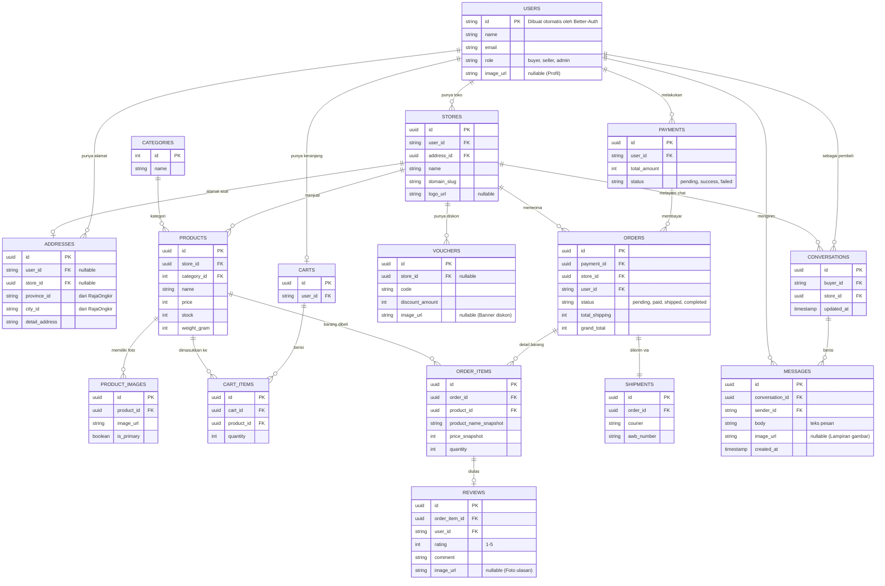

# Dokumen ERD dan Contoh Data (Step 2)

Dokumen ini berisi Rancangan Relasi Database (ERD) beserta contoh nyata bagaimana data disimpan saat ada transaksi yang terjadi, khususnya skenario *checkout* dari banyak toko sekaligus.

## 1. Visualisasi ERD (Entity Relationship Diagram)

Diagram di bawah ini menggambarkan bagaimana setiap entitas saling terhubung.

---

## 2. Simulasi Data (Contoh Kasus)

Agar lebih mudah dibayangkan, mari kita gunakan skenario berikut:
> **Budi** (Pembeli) sedang *checkout* keranjang belanjanya. Ia membeli:
> - 1 pasang **"Sepatu Nike"** dari **Toko Sepatu A** (Harga Rp500.000)
> - 2 buah **"Kaos Polos"** dari **Toko Baju B** (Harga @Rp50.000 = Rp100.000)
> 
> Budi melakukan *checkout* sekaligus dalam satu layar aplikasi. Ongkir dari Toko A ke alamat Budi adalah **Rp20.000**, dan ongkir dari Toko B ke alamat Budi adalah **Rp15.000**.

Berikut adalah gambaran datanya setelah Budi menekan tombol **"Bayar"**:

### A. Data Master (Tabel Utama)

**Tabel `users`**
| id | name | email | role |
| :--- | :--- | :--- | :--- |
| U1 | Budi | budi@email.com | buyer |
| U2 | Andi | andi@email.com | seller |
| U3 | Citra | citra@email.com | seller |

**Tabel `stores`**
| id | user_id | name | domain_slug |
| :--- | :--- | :--- | :--- |
| S1 | U2 | Toko Sepatu A | toko-sepatu-a |
| S2 | U3 | Toko Baju B | toko-baju-b |

**Tabel `products`**
| id | store_id | name | price | stock | weight_gram |
| :--- | :--- | :--- | :--- | :--- | :--- |
| P1 | S1 | Sepatu Nike | 500000 | 10 | 800 |
| P2 | S2 | Kaos Polos | 50000 | 50 | 200 |

---

### B. Proses Transaksi (Data saat Checkout)

Saat Budi *checkout*, sistem menangani pembayarannya secara global (digabung), namun pesanannya dipecah per-toko.

#### 1. Tabel `payments` (Satu Pembayaran Global untuk Semua Pesanan)
Sistem hanya membuat 1 buah *invoice* tagihan ke Midtrans/Xendit agar Budi tidak pusing harus transfer dua kali.
| id | user_id | total_amount | status |
| :--- | :--- | :--- | :--- |
| PAY-001 | U1 | **635000** | success |

*(Cara hitung total_amount: Harga Barang (Rp500.000 + Rp100.000) + Total Ongkir (Rp20.000 + Rp15.000) = **Rp635.000**)*

#### 2. Tabel `orders` (Dipecah per Toko!)
Sistem akan otomatis **memecah pesanan menjadi 2 baris data** agar Toko A dan Toko B bisa memproses pesanan masing-masing secara terpisah di dashboard mereka.
| id | payment_id | store_id | user_id | status | total_shipping | grand_total |
| :--- | :--- | :--- | :--- | :--- | :--- | :--- |
| ORD-001 | PAY-001 | **S1** (Toko A) | U1 | paid | 20000 | 520000 |
| ORD-002 | PAY-001 | **S2** (Toko B) | U1 | paid | 15000 | 115000 |

#### 3. Tabel `order_items` (Detail Barang dari Pesanan)
Di sinilah **Snapshot Harga** bekerja. Kalau bulan depan Sepatu Nike harganya naik jadi Rp600.000, riwayat belanja Budi (di dalam data ini) tetap tercatat Rp500.000.
| id | order_id | product_id | product_name_snapshot | price_snapshot | quantity |
| :--- | :--- | :--- | :--- | :--- | :--- |
| ITEM-1 | ORD-001 | P1 | Sepatu Nike | 500000 | 1 |
| ITEM-2 | ORD-002 | P2 | Kaos Polos | 50000 | 2 |

#### 4. Tabel `shipments` (Resi masing-masing toko)
Karena ada 2 pesanan berbeda dari 2 toko, maka ada 2 pengiriman yang berbeda pula (bisa dengan kurir yang beda).
| id | order_id | courier | awb_number (Resi) |
| :--- | :--- | :--- | :--- |
| SHP-1 | ORD-001 | jne | *(Belum diinput Toko A)* |
| SHP-2 | ORD-002 | jnt | *(Belum diinput Toko B)* |

---

### C. Proses Chat Realtime (Contoh Kasus)

Bayangkan **Budi (U1)** ingin bertanya kepada **Toko Sepatu A (S1)**.

#### 1. Tabel `conversations` (Ruang Obrolan)
Saat Budi pertama kali mengklik "Chat Penjual", sistem mengecek apakah mereka pernah chat sebelumnya. Jika belum, sistem membuat satu baris (ruang) baru. **Tabel ini hanya diisi SATU KALI untuk setiap pasangan Pembeli dan Toko.**
| id | buyer_id | store_id | updated_at |
| :--- | :--- | :--- | :--- |
| CONV-001 | U1 (Budi) | S1 (Toko A) | 2026-05-05 10:00:00 |

*(Tabel ini sangat ringan karena hanya menyimpan 1 baris per relasi toko-pembeli. Tabel inilah yang dipanggil untuk menampilkan daftar list "Kotak Masuk" (Inbox) di aplikasi).*

#### 2. Tabel `messages` (Riwayat Obrolan / Isi Chat)
Setelah ruang `CONV-001` terbentuk, setiap kali Budi atau Toko A mengetik dan mengirim pesan, datanya masuk ke sini.
| id | conversation_id | sender_id | body | image_url | created_at |
| :--- | :--- | :--- | :--- | :--- | :--- |
| MSG-1 | CONV-001 | **U1** (Budi) | "Halo min, sepatu size 42 ready?" | *(null)* | 10:01:00 |
| MSG-2 | CONV-001 | **U2** (Andi / Toko A) | "Ready kak, silakan diorder ya!" | *(null)* | 10:02:00 |
| MSG-3 | CONV-001 | **U1** (Budi) | *(null)* | `https://s3.aws.../sepatu.jpg` | 10:03:00 |

*(Di MSG-3 Budi hanya mengirim gambar tanpa teks. Di MSG-2, pengirimnya adalah `U2` karena Andi adalah user pemilik Toko Sepatu A).*

Jika besok Budi ingin chat Toko A lagi, sistem **tidak** membuat `conversations` baru, melainkan hanya menambah baris baru di tabel `messages` di bawahnya dengan `conversation_id` yang sama (`CONV-001`).

---
## 3. Kesimpulan Penting dari Desain Ini
- **Pembeli** (Budi) merasa pengalaman belanjanya sangat praktis: 1x Checkout, 1x Transfer bayar ke Virtual Account, tapi barang dari banyak toko bisa diproses.
- **Penjual** (Andi dan Citra) masing-masing hanya melihat notifikasi Order yang masuk ke toko mereka.
- Ini adalah pola **mutlak** yang dipakai oleh e-commerce sekelas Shopee / Tokopedia.

---

## 4. Arsitektur Relational & Websocket Chat

Karena Anda memutuskan untuk **tidak** menggunakan Convex dan beralih ke **Websocket** (misalnya Socket.io), maka seluruh data obrolan akan **disimpan ke dalam database utama (MySQL / PostgreSQL)** bersama dengan data E-commerce Anda.

### A. Skema Tabel Chat
1. **`CONVERSATIONS`**: Tabel ini menghubungkan pembeli (`buyer_id`) dan toko (`store_id`).
2. **`MESSAGES`**: Menyimpan riwayat pesan secara berurutan. Terdapat kolom `image_url` yang akan diisi jika pengguna melampirkan gambar pada pesannya.

### B. Manajemen User dengan Better-Auth
Tabel `users` dan tabel sesi keamanan lainnya (`sessions`, `accounts`) akan dibuat secara otomatis oleh Better-Auth di database utama Anda. Anda hanya perlu menggunakan tipe `string` untuk `user_id` di tabel-tabel di atas yang merujuk ke ID dari Better-Auth (termasuk sebagai `buyer_id` dan `sender_id` di tabel chat).

Dengan pendekatan ini, seluruh data sistem Anda terpusat di satu tempat (Monolith Database), yang membuatnya lebih mudah di-backup dan diatur relasinya (Foreign Keys) secara langsung!
