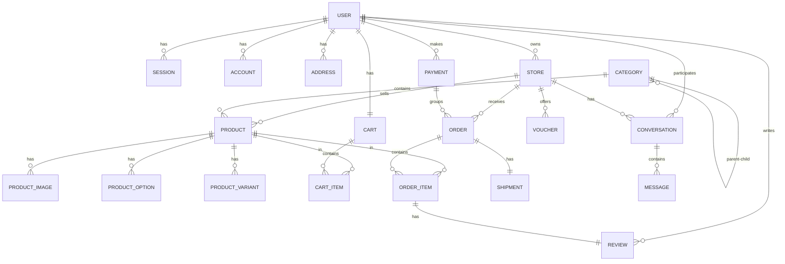

# KiriMart (Kawanbelanja) — Analisis Arsitektur Lengkap

## 🏗️ Overview

**KiriMart** (branded sebagai **Kawanbelanja**) adalah platform **multi-vendor e-commerce** yang dibangun menggunakan arsitektur modern full-stack.

| Aspek | Detail |
|:------|:-------|
| **Framework** | Next.js 16.2.4 (App Router) |
| **React** | 19.2.4 |
| **Runtime** | Bun |
| **Database** | PostgreSQL via Drizzle ORM 0.45 |
| **Auth** | Better Auth 1.6.9 (Google OAuth + Email/Password) |
| **State Mgmt** | TanStack React Query 5 |
| **Styling** | Tailwind CSS v4 + shadcn/ui + Radix UI |
| **Validation** | Zod v4 |
| **Forms** | React Hook Form + @hookform/resolvers |
| **Email** | Resend |
| **Shipping** | KiriminAja API (mock saat ini) |
| **File Upload** | Proxy server terpisah (port 4004) |
| **Payment** | Midtrans Sandbox (credential sudah ada, belum terintegrasi) |

---

## 📁 Struktur Folder

```
kirimart/
├── docs/                           # Dokumentasi (Midtrans, dll)
├── public/                         # Asset statis
├── src/
│   ├── actions/                    # ⚡ Server Actions (Layer 3)
│   │   ├── admin-dashboard/
│   │   │   ├── category/           # CRUD kategori ✅
│   │   │   ├── product/
│   │   │   ├── store/
│   │   │   ├── user/
│   │   │   └── voucher/
│   │   ├── seller-dashboard/
│   │   │   ├── product/            # CRUD produk ✅
│   │   │   └── voucher/
│   │   ├── protected/
│   │   │   └── store.actions.js    # Create store ✅
│   │   ├── public/                 # ❌ Kosong
│   │   ├── user-dashboard/
│   │   │   ├── address.actions.js  # CRUD alamat ✅
│   │   │   └── profile.actions.js  # Update profil ✅
│   │   └── kiriminaja/             # Shipping API actions
│   │
│   ├── app/                        # 📄 Pages (Layer 6)
│   │   ├── (auth)/                 # Sign-in, Sign-up
│   │   ├── (public)/               # 🏪 Storefront
│   │   │   ├── page.jsx            # Homepage
│   │   │   ├── layout.jsx          # Navbar + Footer
│   │   │   ├── katalog/            # Product catalog
│   │   │   ├── product/[id]/       # Product detail
│   │   │   ├── store/              # Store page
│   │   │   ├── cart/               # Keranjang ← MOCK DATA
│   │   │   ├── checkout/           # Checkout ← MOCK DATA
│   │   │   └── chat/               # Chat buyer-seller
│   │   ├── (protected)/
│   │   │   ├── create-store/       # Onboarding toko
│   │   │   └── user-dashboard/     # Profil + Alamat
│   │   ├── admin-dashboard/        # 🔧 Admin Panel
│   │   │   ├── categories/         # Kategori CRUD
│   │   │   ├── products/           # Produk management
│   │   │   ├── stores/             # Toko management
│   │   │   ├── users/              # User management
│   │   │   └── vouchers/           # Voucher platform
│   │   ├── seller-dashboard/       # 🏬 Seller Panel
│   │   │   ├── products/           # Produk CRUD
│   │   │   ├── orders/             # Pesanan ← belum impl
│   │   │   ├── store/              # Profil toko
│   │   │   └── vouchers/           # Voucher toko
│   │   ├── api/auth/               # Better Auth API handler
│   │   ├── data/                   # Data loaders
│   │   ├── layout.jsx              # Root layout
│   │   └── globals.css             # Global styles
│   │
│   ├── components/                 # 🧩 UI Components
│   │   ├── ui/                     # shadcn/ui primitives
│   │   ├── global/                 # Breadcrumb, ThemeToggle
│   │   ├── layout/                 # Sidebar, Dashboard layouts
│   │   ├── public/                 # Public-facing components
│   │   ├── shared/                 # Reusable components
│   │   └── table/                  # Data table components
│   │
│   ├── config/                     # ⚙️ Configuration
│   │   ├── constants/menu.js       # Sidebar menu config
│   │   ├── db/
│   │   │   ├── index.js            # DB connection (Drizzle)
│   │   │   ├── schema/             # 18 schema files
│   │   │   └── migrations/         # DB migrations
│   │   └── env/index.js            # Env validation (t3-env)
│   │
│   ├── features/                   # 🎯 Feature Views (Layer 5)
│   │   ├── public/
│   │   │   ├── navbar.jsx
│   │   │   ├── footer.jsx
│   │   │   ├── hero-section.jsx
│   │   │   ├── catalog/
│   │   │   ├── product/
│   │   │   ├── cart/cart-view.jsx   # ← MOCK DATA
│   │   │   ├── checkout/checkout-view.jsx  # ← MOCK DATA
│   │   │   ├── chat-view.jsx
│   │   │   └── store-view.jsx
│   │   ├── admin-dashboard/
│   │   │   ├── category/
│   │   │   ├── product/
│   │   │   ├── store/
│   │   │   ├── user/
│   │   │   └── voucher/
│   │   ├── seller-dashboard/
│   │   │   ├── product/
│   │   │   ├── order/
│   │   │   ├── store/
│   │   │   └── voucher/
│   │   ├── user-dashboard/
│   │   │   ├── profile/
│   │   │   └── address/
│   │   └── create-store/
│   │
│   ├── hooks/                      # Custom hooks
│   │   └── use-mobile.js
│   │
│   ├── lib/                        # 📚 Utilities & Core
│   │   ├── auth.js                 # Better Auth server config
│   │   ├── auth-client.js          # Better Auth client
│   │   ├── permissions.js          # RBAC (Access Control)
│   │   ├── const-data.js           # Status enums
│   │   ├── utils.js                # cn() helper
│   │   ├── kiriminaja-mock.js      # Mock data wilayah
│   │   └── validations/            # Zod schemas (Layer 2)
│   │
│   ├── providers/                  # React providers
│   │   ├── provider.jsx            # Root provider wrapper
│   │   ├── react-query-provider.jsx
│   │   └── theme-provider.jsx
│   │
│   └── proxy.js                    # Route protection (middleware)
│
├── .env                            # Environment variables
├── drizzle.config.js               # Drizzle Kit config
└── package.json
```

---

## 🗄️ Database Schema (18 Tabel)

### ERD Overview



### Detail Tabel

| # | Tabel | Kolom Utama | Catatan |
|:-:|:------|:------------|:--------|
| 1 | `user` | id, name, email, role, banned | Better Auth managed, roles: admin/user/member/seller |
| 2 | `session` | id, userId, token, expiresAt | Better Auth sessions |
| 3 | `account` | id, userId, providerId | OAuth accounts (Google) |
| 4 | `verification` | id, identifier, value | Email verification |
| 5 | `rate_limit` | id, key, count | Rate limiting |
| 6 | `addresses` | id, userId, storeId, provinceId, cityId... | Shared antara user dan store |
| 7 | `stores` | id, userId, name, domainSlug, isStar | Multi-vendor stores |
| 8 | `categories` | id, parentId, name, slug, iconUrl | Hierarchical (parent-child) |
| 9 | `products` | id, storeId, categoryId, basePrice, weightGram, soldCount, rating, discountRules | Dengan varian system |
| 10 | `product_images` | id, productId, imageUrl, isPrimary | Multiple images |
| 11 | `product_options` | id, productId, name, values (JSONB) | Definisi opsi: Warna, Ukuran |
| 12 | `product_variants` | id, productId, attributes (JSONB), price, stock, sku | Kombinasi spesifik SKU |
| 13 | `carts` | id, userId | 1 cart per user |
| 14 | `cart_items` | id, cartId, productId, quantity | Items dalam cart |
| 15 | `vouchers` | id, storeId, code, discountType, discountValue, quota... | Store-level + platform-level |
| 16 | `payments` | id, userId, totalAmount, status | ⚠️ Belum ada field Midtrans |
| 17 | `orders` | id, paymentId, storeId, userId, status, grandTotal | Per-store order |
| 18 | `order_items` | id, orderId, productId, priceSnapshot, quantity | Snapshot harga saat order |
| 19 | `shipments` | id, orderId, courier, awbNumber, kiriminajaOrderId | Tracking pengiriman |
| 20 | `reviews` | id, orderItemId, userId, rating, comment | Per order item |
| 21 | `conversations` | id, buyerId, storeId | Chat buyer-seller |
| 22 | `messages` | id, conversationId, senderId, body | Chat messages |

---

## 🔐 Arsitektur Auth & RBAC

### Flow Auth

```
Better Auth → Google OAuth / Email+Password
           ↓
   Session Cookie (httpOnly)
           ↓
   proxy.js (Route Protection)
           ↓
   Role Check: admin / seller / user / member
```

### Route Protection (proxy.js)

| Rule | Routes | Condition |
|:-----|:-------|:----------|
| Closed | `/sign-up` | Redirect ke `/` (registrasi ditutup) |
| Auth redirect | `/sign-in`, `/sign-up` | Jika sudah login → redirect `/` |
| Admin only | `/admin-dashboard/*` | Harus login + role=admin |
| Seller only | `/seller-dashboard/*` | Harus login + role=seller |
| Protected | `/create-store/*` | Harus login (role apapun) |

### Roles & Permissions

| Role | Akses |
|:-----|:------|
| `admin` | Full admin dashboard, user management, CRUD semua entity |
| `seller` | Seller dashboard, produk CRUD, order management, voucher |
| `user` | Storefront, cart, checkout, profil, alamat |
| `member` | Extended user (belum diimplementasi secara spesifik) |

---

## 🏗️ Arsitektur 7-Layer

```
┌─────────────────────────────────────────────────────┐
│  Layer 7: Layout (layout.jsx)                       │
│  Sidebar, Navbar, Footer, Providers                 │
├─────────────────────────────────────────────────────┤
│  Layer 6: Page (page.jsx)                           │
│  Route handler, metadata, renders Feature View      │
├─────────────────────────────────────────────────────┤
│  Layer 5: Feature View (features/*-view.jsx)        │
│  Komponen UI utama, state management, forms         │
├─────────────────────────────────────────────────────┤
│  Layer 4: Hooks (hooks/ + React Query)              │
│  useMutation, useQuery, custom hooks                │
├─────────────────────────────────────────────────────┤
│  Layer 3: Server Actions (actions/*.actions.js)     │
│  "use server", business logic, DB queries           │
├─────────────────────────────────────────────────────┤
│  Layer 2: Validation (lib/validations/*.js)         │
│  Zod schemas, form validation                       │
├─────────────────────────────────────────────────────┤
│  Layer 1: Schema (config/db/schema/*.js)            │
│  Drizzle ORM table definitions, relations           │
└─────────────────────────────────────────────────────┘
```

---

## 📊 Status Implementasi

### ✅ Selesai (Fully Implemented)

| Feature | Scope | Detail |
|:--------|:------|:-------|
| Auth System | All | Google OAuth, email/password, session, RBAC |
| Admin — Categories | CRUD | Hierarchical, slug, icon, delete protection |
| Admin — Users | List | User management |
| Admin — Stores | List | Store management |
| Admin — Vouchers | CRUD | Platform-wide vouchers |
| Seller — Products | CRUD | Multi-variant, options, images, edit |
| Seller — Store Profile | RU | Update profil toko |
| Seller — Vouchers | CRUD | Store-level vouchers |
| User — Profile | RU | Update profil |
| User — Address | CRUD | Alamat pengiriman dengan wilayah |
| Store Onboarding | Create | Buat toko + auto role change |
| Public — Homepage | View | Hero section, product grid, flash sale |
| Public — Catalog | View | Product listing + filter |
| Public — Product Detail | View | Detail + variant selector |
| Public — Store Page | View | Halaman toko |
| Public — Chat | View | Real-time chat buyer-seller |

### ⚠️ Menggunakan Mock Data (Perlu Integrasi)

| Feature | Status | Detail |
|:--------|:-------|:-------|
| **Cart** | Mock UI | `cart-view.jsx` menggunakan `MOCK_CART` hardcoded, belum terhubung ke DB |
| **Checkout** | Mock UI | `checkout-view.jsx` menggunakan `MOCK_CHECKOUT` + `MOCK_ADDRESS` hardcoded |
| **Payment** | Not impl | Tombol "Bayar Sekarang" hanya `alert("Demo")` |
| **Shipping Options** | Mock | Opsi pengiriman hardcoded, KiriminAja masih mock |

### ❌ Belum Diimplementasi

| Feature | Layer yang Kurang |
|:--------|:-----------------|
| **Cart CRUD Actions** | Server Actions kosong (`actions/public/` empty) |
| **Checkout Process** | Tidak ada action untuk membuat order |
| **Midtrans Integration** | Credential ada di `.env`, tapi tidak ada code integrasi |
| **Webhook Handler** | Tidak ada `api/midtrans/notification/route.js` |
| **Order Management** | Seller order page kosong |
| **Shipment Tracking** | Schema ada, logic belum |

---

## 💳 Kesiapan Integrasi Payment (Midtrans)

### Yang Sudah Ada

| ✅ | Detail |
|:--|:-------|
| Midtrans credentials di `.env` | `CLIENT_KEY`, `SERVER_KEY`, `MERCHANT_ID`, `PAYMENT_URL` |
| Payment schema di DB | `payments` table (id, userId, totalAmount, status) |
| Order schema di DB | `orders` table (id, paymentId, storeId, userId, status, grandTotal) |
| Checkout UI | Layout checkout lengkap dengan payment method selection |
| Dokumentasi | `docs/midtrans-payment-gateway.md` sudah dibuat |

### Yang Perlu Dibangun

| ❌ | Detail |
|:--|:-------|
| **Payment schema** perlu diperluas | Tambah: `midtransTransactionId`, `snapToken`, `paymentType`, `paymentMethod`, `expiresAt`, `paidAt`, timestamps |
| **Order schema** perlu diperluas | Tambah: `createdAt`, `updatedAt`, `paidAt`, `notes` |
| **Env config** perlu diupdate | Midtrans keys belum masuk `t3-env` validation |
| **Server Action** create payment | Generate Snap token, create payment + orders di DB |
| **API Route** webhook | `app/api/midtrans/notification/route.js` |
| **Snap JS** di layout | Load script `snap.js` di root/public layout |
| **Cart → DB** integration | Cart actions untuk add/remove/update items |
| **Checkout → real data** | Replace MOCK data dengan data dari cart DB |

---

## 🔑 Environment Variables

| Variable | Digunakan | Status |
|:---------|:----------|:-------|
| `DATABASE_URL` | ✅ | PostgreSQL lokal |
| `BETTER_AUTH_SECRET` | ✅ | Auth encryption |
| `GOOGLE_CLIENT_SECRET` | ✅ | OAuth |
| `RESEND_API_KEY` | ✅ | Email |
| `NEXT_PUBLIC_UPLOAD_URI` | ✅ | File upload server (port 4004) |
| `KIRIMINAJA_API_URL` | ⚠️ | Mock, belum terintegrasi penuh |
| `PAYMENT_URL` | ❌ | Ada tapi belum dipakai di code |
| `CLIENT_KEY` | ❌ | Ada tapi belum dipakai di code |
| `SERVER_KEY` | ❌ | Ada tapi belum dipakai di code |
| `MERCHANT_ID` | ❌ | Ada tapi belum dipakai di code |

---

## 📝 Catatan Penting

1. **Naming inconsistency**: Package name `kawanbelanja`, brand `KawanBelanja`, folder `kirimart`, domain references `KiriMart`
2. **Registrasi ditutup**: Route `/sign-up` di-redirect ke `/` (closed registration)
3. **Upload server terpisah**: File upload menggunakan server proxy di port 4004 dengan API key auth
4. **Proxy bukan middleware**: Next.js 16 menggunakan `proxy.js` bukan `middleware.ts` untuk route protection
5. **Harga dalam integer**: Semua harga disimpan sebagai integer (dalam Rupiah, tanpa desimal)
6. **Variant system**: Produk mendukung multi-variant dengan JSONB attributes pattern
