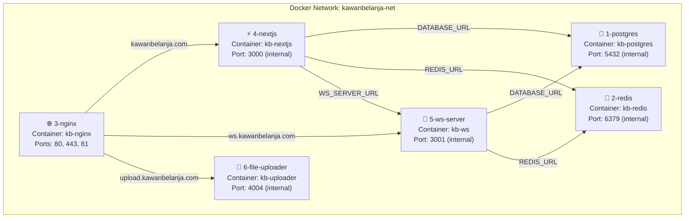
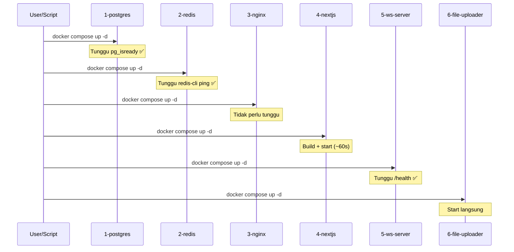

# Deployment Docker Terpisah — KawanBelanja (Updated)

## Struktur Aktual yang Sudah Ada

### GitHub Repo (`kirimart`)
```
kirimart/                              ← REPO ROOT
├── docs/
├── kirimart/                          ← NEXT.JS APP (nested!)
│   ├── src/
│   ├── ws-server/                     ← WS SERVER (di dalam Next.js)
│   │   ├── Dockerfile
│   │   ├── package.json
│   │   └── src/
│   ├── Dockerfile                     ← Next.js Dockerfile
│   ├── docker-compose.yml             ← Dev compose (existing)
│   ├── docker-compose.prod.yml        ← Prod compose lama (existing)
│   ├── .env.production
│   └── ...
└── Analyzing Architecture And Docker Integration.md
```

### VPS (`/home/deploy/kawanbelanja/`)
```
/home/deploy/kawanbelanja/
├── file-uploader-kawanbelanja/        ← REPO TERPISAH (sudah di-clone)
│   ├── Dockerfile
│   ├── docker-compose.prod-id.yml
│   ├── server.js
│   ├── src/
│   └── ...
└── kirimart/                          ← GIT CLONE repo kirimart
    ├── docs/
    ├── kirimart/                      ← Next.js app ada DI SINI
    │   ├── src/
    │   ├── ws-server/
    │   └── ...
    └── ...
```

---

## Rencana: Folder `deploy/` di Repo Root

Saya akan membuat folder `deploy/` di **repo root** (`kirimart/`), sehingga ketika di-clone ke VPS, semua file deployment sudah ada.

### Struktur Baru (yang akan dibuat)

```
kirimart/                              ← REPO ROOT
├── deploy/                            ← ★ BARU — semua config deployment
│   ├── .env.production                ← Satu file env untuk semua service
│   ├── create-network.sh             ← Buat Docker network (1x saja)
│   ├── start-all.sh                  ← Start semua berurutan + health check
│   ├── stop-all.sh                   ← Stop semua
│   ├── status.sh                     ← Cek status semua container
│   ├── migrate.sh                    ← Jalankan DB migration
│   │
│   ├── 1-postgres/
│   │   └── docker-compose.yml
│   │
│   ├── 2-redis/
│   │   └── docker-compose.yml
│   │
│   ├── 3-nginx/
│   │   └── docker-compose.yml
│   │
│   ├── 4-nextjs/
│   │   └── docker-compose.yml        ← Build context → ../../kirimart/
│   │
│   ├── 5-ws-server/
│   │   └── docker-compose.yml        ← Build context → ../../kirimart/ws-server/
│   │
│   └── 6-file-uploader/
│       └── docker-compose.yml        ← Build context → ../../../file-uploader-kawanbelanja/
│
├── kirimart/                          ← NEXT.JS APP (tidak diubah)
│   ├── Dockerfile                     ← EXISTING (akan di-improve)
│   ├── ws-server/
│   │   └── Dockerfile                 ← EXISTING (akan di-improve)
│   ├── src/
│   └── ...
└── docs/
```

### Path Resolution di VPS

Semua path diverifikasi berdasarkan struktur VPS Anda:

```
/home/deploy/kawanbelanja/kirimart/deploy/                    ← CWD untuk scripts
                                                               
Dari docker-compose.yml di 4-nextjs/:                          
  context: ../../kirimart                                      
  → /home/deploy/kawanbelanja/kirimart/kirimart/  ✅           

Dari docker-compose.yml di 5-ws-server/:                       
  context: ../../kirimart/ws-server                            
  → /home/deploy/kawanbelanja/kirimart/kirimart/ws-server/  ✅

Dari docker-compose.yml di 6-file-uploader/:                   
  context: ../../../file-uploader-kawanbelanja                 
  → /home/deploy/kawanbelanja/file-uploader-kawanbelanja/  ✅  

Dari semua docker-compose.yml:                                 
  env_file: ../.env.production                                 
  → /home/deploy/kawanbelanja/kirimart/deploy/.env.production  ✅
```

---

## Arsitektur Koneksi



### Hostname Internal Docker
Setiap service menggunakan **container name** sebagai hostname di dalam Docker network:

| Service | Container Name | Hostname untuk service lain |
|---------|---------------|---------------------------|
| PostgreSQL | `kb-postgres` | `kb-postgres:5432` |
| Redis | `kb-redis` | `kb-redis:6379` |
| Nginx PM | `kb-nginx` | — (exposed ke host) |
| Next.js | `kb-nextjs` | `kb-nextjs:3000` |
| WS Server | `kb-ws` | `kb-ws:3001` |
| File Uploader | `kb-uploader` | `kb-uploader:4004` |

> [!IMPORTANT]
> Container name berubah dari yang lama! Dulu: `kawanbelanja-postgres`, `kawanbelanja-app`, dll.
> Sekarang disingkat: `kb-postgres`, `kb-nextjs`, dll. — agar lebih pendek saat `docker logs kb-nextjs`.

---

## Environment Variables: Satu File

Semua env vars dikumpulkan di **`deploy/.env.production`**. Setiap docker-compose mereferensi file ini dengan `env_file: ../.env.production`.

### Perbedaan dari Setup Lama

| Dulu | Sekarang |
|------|----------|
| Env di `.env.production` + override di `docker-compose.prod.yml` | **Satu file** `deploy/.env.production` |
| `DATABASE_URL=postgres://...@postgres:5432/...` (hostname `postgres`) | `DATABASE_URL=postgres://...@kb-postgres:5432/...` (hostname `kb-postgres`) |
| `REDIS_URL=redis://redis:6379` | `REDIS_URL=redis://kb-redis:6379` |
| `WS_SERVER_URL=http://ws-server:3001` | `WS_SERVER_URL=http://kb-ws:3001` |

---

## Urutan Start & Health Check



---

## Proposed Changes (Detail Per File)

### Scripts

---

#### [NEW] `deploy/create-network.sh`
Buat Docker network external. **Jalankan hanya 1x** setelah pertama kali clone.
```bash
docker network create kawanbelanja-net
```

---

#### [NEW] `deploy/start-all.sh`
Script yang start semua service berurutan:
1. Start PostgreSQL → loop `pg_isready` sampai ready
2. Start Redis → loop `redis-cli ping` sampai PONG
3. Start Nginx PM
4. Start Next.js (build image jika belum ada)
5. Start WS Server → cek `/health`
6. Start File Uploader
- Menampilkan status akhir semua container

---

#### [NEW] `deploy/stop-all.sh`
Stop semua service urutan terbalik (file-uploader → ws → nextjs → nginx → redis → postgres).

---

#### [NEW] `deploy/status.sh`
Menampilkan status + resource usage semua container `kb-*`.

---

#### [NEW] `deploy/migrate.sh`
Menjalankan `drizzle-kit push` via Docker container sementara yang terhubung ke network.

---

#### [NEW] `deploy/.env.production`
File environment tunggal. Isi sama dengan `.env.production` yang sudah ada, tapi hostname Docker diupdate:
- `postgres` → `kb-postgres`
- `redis` → `kb-redis`
- `ws-server` → `kb-ws`

---

### Service 1: PostgreSQL

#### [NEW] `deploy/1-postgres/docker-compose.yml`
```yaml
# PostgreSQL 16 — Database utama
# Start: docker compose up -d
# Logs:  docker compose logs -f
# Stop:  docker compose down (DATA TETAP AMAN di volume)
```
- Image: `postgres:16-alpine`
- Container name: `kb-postgres`
- Volume: `kb-pg-data` (persisten, data tidak hilang saat down)
- Health check: `pg_isready`
- Tuning PostgreSQL untuk VPS (shared_buffers, max_connections, dll)
- **Tidak expose port ke host** — hanya accessible dari Docker network
- Network: `kawanbelanja-net` (external)

---

### Service 2: Redis

#### [NEW] `deploy/2-redis/docker-compose.yml`
- Image: `redis:7-alpine`
- Container name: `kb-redis`
- Volume: `kb-redis-data`
- Config: `appendonly yes`, `maxmemory 200mb`, `allkeys-lru`
- Health check: `redis-cli ping`
- Network: `kawanbelanja-net` (external)

---

### Service 3: Nginx Proxy Manager

#### [NEW] `deploy/3-nginx/docker-compose.yml`
- Image: `jc21/nginx-proxy-manager:latest`
- Container name: `kb-nginx`
- Ports: `80:80`, `443:443`, `81:81`
- Volumes: `kb-npm-data`, `kb-npm-letsencrypt`
- Network: `kawanbelanja-net` (external)

Setelah start, setup Proxy Host di UI `:81`:

| Domain | Forward To | WebSocket |
|--------|-----------|-----------|
| `kawanbelanja.com` | `kb-nextjs:3000` | Off |
| `ws.kawanbelanja.com` | `kb-ws:3001` | **On** |
| `upload.kawanbelanja.com` | `kb-uploader:4004` | Off |

---

### Service 4: Next.js App

#### [NEW] `deploy/4-nextjs/docker-compose.yml`
- Build context: `../../kirimart` (pointing ke Next.js app folder)
- Dockerfile: `Dockerfile` (yang ada di `kirimart/Dockerfile`)
- Container name: `kb-nextjs`
- Memory limit: 1GB
- Restart: `unless-stopped`
- Logging: json-file, max 10MB × 3 files
- Health check: `wget http://localhost:3000`
- Network: `kawanbelanja-net` (external)
- env_file: `../.env.production`

#### [MODIFY] `kirimart/Dockerfile`
Improve multi-stage build:
- Tambahkan `HEALTHCHECK`
- Pastikan `.env.production` di-copy dari env_file (bukan hardcoded)
- Tambahkan `--frozen-lockfile` untuk reproducible builds

---

### Service 5: WebSocket Server

#### [NEW] `deploy/5-ws-server/docker-compose.yml`
- Build context: `../../kirimart/ws-server`
- Dockerfile: `Dockerfile` (yang ada di `ws-server/Dockerfile`)
- Container name: `kb-ws`
- Memory limit: 256MB
- Network: `kawanbelanja-net` (external)
- env_file: `../.env.production`

#### [MODIFY] `kirimart/ws-server/Dockerfile`
Sudah bagus, minor improvements:
- Pastikan health check menggunakan `wget` (sudah ada di Alpine)

---

### Service 6: File Uploader

#### [NEW] `deploy/6-file-uploader/docker-compose.yml`
- Build context: `../../../file-uploader-kawanbelanja` (repo terpisah yang sudah ada di VPS)
- Dockerfile: `Dockerfile` (yang ada di repo file-uploader)
- Container name: `kb-uploader`
- Volume: `kb-upload-data:/app/public` (media persisten)
- Memory limit: 128MB
- Network: `kawanbelanja-net` (external)
- env_file: `../.env.production`

---

### File yang TIDAK Diubah
- `kirimart/docker-compose.yml` — Tetap untuk development lokal
- `kirimart/docker-compose.prod.yml` — Tidak dihapus (backup/referensi)
- `kirimart/.env.production` — Tetap ada, tapi tidak dipakai di deploy baru

---

## Cara Pakai di VPS

### Pertama Kali (Setup Awal)
```bash
# 1. Clone repo
cd /home/deploy/kawanbelanja
git clone git@github.com:RedyPutraSembada/kirimart.git

# 2. Masuk ke folder deploy
cd kirimart/deploy

# 3. Edit environment variables
cp .env.production.example .env.production
nano .env.production   # isi semua nilai

# 4. Buat Docker network (1x saja)
bash create-network.sh

# 5. Start semua berurutan
bash start-all.sh

# 6. Jalankan migrasi database
bash migrate.sh

# 7. Setup Nginx Proxy Manager
# Buka http://IP_VPS:81
# Login: admin@example.com / changeme
# Setup 3 proxy host (kawanbelanja.com, ws., upload.)
```

### Update Deployment (Setelah Push Code Baru)
```bash
cd /home/deploy/kawanbelanja/kirimart
git pull origin main

# Rebuild + restart HANYA service yang berubah
cd deploy/4-nextjs
docker compose build --no-cache
docker compose up -d

# Atau untuk WS Server
cd ../5-ws-server
docker compose build --no-cache
docker compose up -d
```

### Manage Satu Service
```bash
# Lihat log Next.js
cd deploy/4-nextjs && docker compose logs -f

# Restart Redis saja
cd deploy/2-redis && docker compose restart

# Stop WS Server saja (tanpa ganggu service lain)
cd deploy/5-ws-server && docker compose down

# Rebuild file-uploader setelah update repo-nya
cd deploy/6-file-uploader
docker compose build --no-cache
docker compose up -d
```

---

## Open Questions

> [!IMPORTANT]
> ### 1. VPS RAM
> Berapa GB RAM VPS Anda? Ini menentukan memory limit per container:
> - **2GB**: PostgreSQL 256MB, Redis 128MB, Next.js 512MB, WS 128MB, Uploader 64MB
> - **4GB**: PostgreSQL 512MB, Redis 256MB, Next.js 1GB, WS 256MB, Uploader 128MB
> - **8GB+**: Bisa lebih generous

> [!IMPORTANT]
> ### 2. Midtrans Mode
> Di `.env.production`: `MIDTRANS_IS_PRODUCTION=false` — Ini masih **sandbox**. Mau saya set ke `true` (production) di env baru?

> [!IMPORTANT]
> ### 3. File Uploader Config
> Repo file-uploader sudah punya beberapa compose files (`prod-id`, `prod-v2`, `stg-id`, `stg-v2`). Yang mana yang aktif/benar? Atau saya buatkan compose baru yang fresh?

---

## Verification Plan

### Setelah Semua File Dibuat
Saya akan verifikasi di lokal:
```bash
# Cek syntax semua compose files
docker compose -f deploy/1-postgres/docker-compose.yml config
docker compose -f deploy/2-redis/docker-compose.yml config
# ... dst

# Cek semua path reference valid
# Cek env vars konsisten
```

### Di VPS (Manual)
1. ✅ `bash create-network.sh` — network terbuat
2. ✅ Start 1-postgres → `docker exec kb-postgres pg_isready` → "accepting connections"
3. ✅ Start 2-redis → `docker exec kb-redis redis-cli ping` → "PONG"
4. ✅ Start 3-nginx → `curl http://localhost:81` → NPM admin page
5. ✅ Start 4-nextjs → `curl http://localhost:3000` → HTML response
6. ✅ Start 5-ws-server → `curl http://localhost:3001/health` → `{"status":"ok"}`
7. ✅ Start 6-file-uploader → `curl http://localhost:4004` → response
8. ✅ `bash migrate.sh` → drizzle-kit push success
9. ✅ Setup NPM proxy hosts → `curl https://kawanbelanja.com` → works
