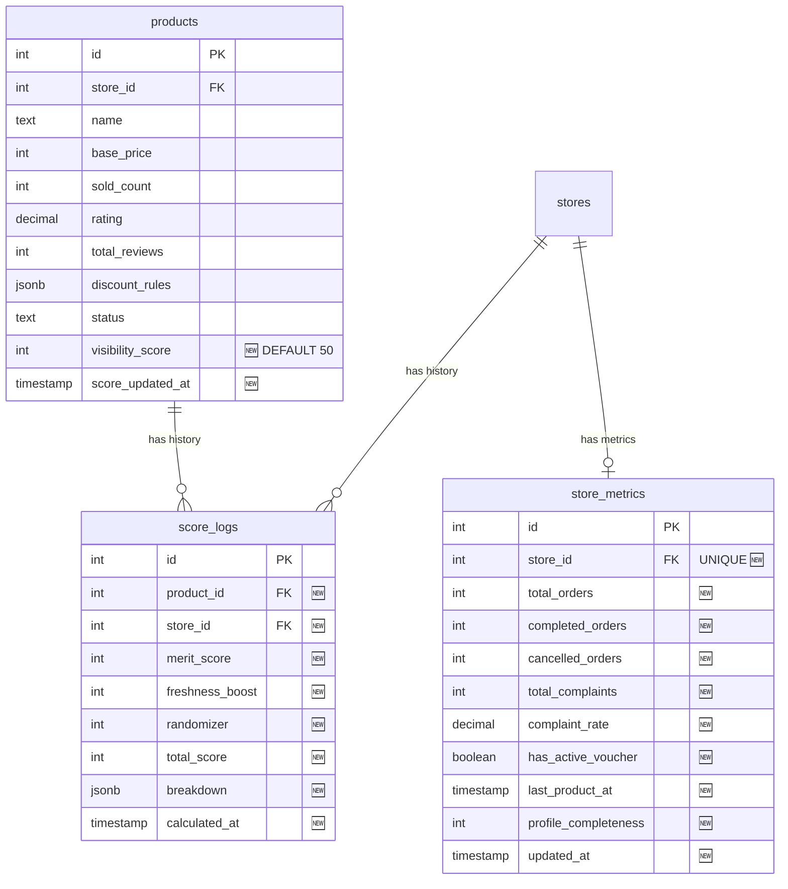

# 🏆 Kawan Belanja Fair Rank System — Implementation Plan

> **Sistem visibilitas produk anti-Pay-to-Win** yang menggantikan sorting by `soldCount` dengan skor komposit yang mempertimbangkan kualitas, kesegaran, dan keacakan terkontrol.

> **Status:** ✅ Disetujui — Siap Eksekusi  
> **Estimasi:** 3-5 hari kerja

---

## Daftar Isi

1. [Ringkasan Strategi](#1-ringkasan-strategi)
2. [Formula Scoring](#2-formula-scoring)
3. [Dampak & File Terdampak](#3-dampak--file-terdampak)
4. [Arsitektur Database](#4-arsitektur-database)
5. [Arsitektur Background Worker](#5-arsitektur-background-worker)
6. [Seller Dashboard: Score Transparency](#6-seller-dashboard-score-transparency)
7. [Checklist Eksekusi](#7-checklist-eksekusi)

---

## 1. Ringkasan Strategi

### Strategi: Hybrid "Kawan Belanja Fair Rank"

```
┌─────────────────────────────────────────────────────┐
│           KAWAN BELANJA FAIR RANK SCORE                  │
│                                                     │
│  score = merit + freshness + randomizer             │
│          (70%)    (20%)       (10%)                 │
│                                                     │
│  ┌────────────────┐                                 │
│  │  MERIT SCORE   │ ← Performa organik seller       │
│  │  (0-100 poin)  │   Rating, sold, review,         │
│  │                │   verified, diskon, voucher      │
│  └────────────────┘                                 │
│  ┌────────────────┐                                 │
│  │ FRESHNESS BOOST│ ← Produk baru (< 7 hari)        │
│  │  (0-30 poin)   │   Time-decay: tinggi di awal,   │
│  │                │   habis setelah 7 hari           │
│  └────────────────┘                                 │
│  ┌────────────────┐                                 │
│  │  RANDOMIZER    │ ← Controlled randomization       │
│  │  (0-10 poin)   │   Berubah setiap 6 jam,          │
│  │                │   seed: product_id XOR time      │
│  └────────────────┘                                 │
└─────────────────────────────────────────────────────┘
```

### Keputusan yang Sudah Disetujui

| Keputusan | Jawaban |
|:----------|:--------|
| Bobot | Merit 70%, Freshness 20%, Random 10% |
| Durasi freshness boost | **7 hari** |
| Score transparency | **Ya** — tampil di seller dashboard |
| Tabel `score_logs` | **Ya** — implementasi sekarang |
| Frekuensi recalculation | Setiap 6 jam via BullMQ |

### Mengapa Strategi Ini Dipilih?

| Komponen | Mengatasi Masalah | Mendukung Prinsip |
|:---------|:------------------|:------------------|
| **Merit Score (70%)** | Seller berkualitas tampil lebih tinggi | **Aman** — buyer aman beli dari seller terpercaya |
| **Freshness Boost (20%)** | Cold start problem seller baru | **Adil** — seller baru dapat kesempatan uji pasar |
| **Randomizer (10%)** | Mencegah posisi "beku" (seller A selalu #1) | **Nyaman** — katalog terasa hidup dan dinamis |

---

## 2. Formula Scoring

### 2A. Merit Score (0–100 poin)

```
merit_score = product_quality + store_reputation + activity_bonus
```

#### Product Quality Score (max 40 poin)

| Komponen | Sumber Data | Formula | Max |
|:---------|:------------|:--------|:---:|
| Rating produk | `products.rating` (1.0–5.0) | `(rating - 1) / 4 × 15` | 15 |
| Jumlah review | `products.totalReviews` | `min(10, log2(reviews + 1) × 2)` | 10 |
| Jumlah terjual | `products.soldCount` | `min(10, log2(sold + 1) × 1.5)` | 10 |
| Diskon aktif | `products.discountRules` / `products.originalPrice` | `IS NOT NULL ? 5 : 0` | 5 |

#### Store Reputation Score (max 40 poin)

| Komponen | Sumber Data | Formula | Max |
|:---------|:------------|:--------|:---:|
| Rating toko | `stores.rating` (1.0–5.0) | `(rating - 1) / 4 × 15` | 15 |
| Toko terverifikasi | `stores.isVerified` | `true ? 10 : 0` | 10 |
| Review toko | `stores.totalReviews` | `min(10, log2(reviews + 1) × 2)` | 10 |
| Tingkat komplain | `store_metrics.complaintRate` | `max(-5, -rate × 5)` | 0 *(penalty)* |

> **Catatan `isVerified` (MVP):** Untuk tahap awal (MVP), status Toko Terverifikasi diberikan secara **manual oleh Admin** melalui dashboard admin untuk mengkurasi toko dengan performa baik. Di fase selanjutnya, proses ini akan menggunakan alur verifikasi KTP/NPWP otomatis.

#### Activity Bonus (max 20 poin)

| Komponen | Sumber Data | Formula | Max |
|:---------|:------------|:--------|:---:|
| Voucher aktif | `store_metrics.hasActiveVoucher` | `true ? 5 : 0` | 5 |
| Kelengkapan profil | Dihitung dari `stores` (logo, banner, desc, bank, courier) | `jumlah_terisi / 5 × 5` | 5 |
| Aktivitas terbaru | `store_metrics.lastProductAt` | `< 30 hari ? 5 : 0` | 5 |
| *Reserved* | *Untuk response time (future)* | *—* | 5 |

### 2B. Freshness Boost (0–30 poin)

```
IF product age < 7 days:
    boost = 30 × (1 - (age_in_days / 7))
    -- Hari 0: boost = 30
    -- Hari 3: boost ≈ 17
    -- Hari 7: boost = 0
ELSE:
    boost = 0
```

### 2C. Randomizer (0–10 poin)

```
time_bucket = FLOOR(epoch_seconds / 21600)   -- berubah setiap 6 jam
seed = product_id XOR time_bucket
randomizer = (seed % 1000) / 100             -- 0.0 - 9.9
```

> **Efek:** Urutan berubah setiap 6 jam (katalog terasa dinamis), tapi **konsisten selama 6 jam** (pagination tidak kacau, cache efektif).

### 2D. Total Score

```
visibility_score = merit_score + freshness_boost + ROUND(randomizer)
-- Range: 0 - 140
```

---

## 3. Dampak & File Terdampak

### 3A. Ringkasan Dampak

```
Total file yang berubah: 10 file
Total file baru:         4 file
Tabel DB baru:           2 tabel
Kolom DB baru:           2 kolom (pada tabel products)
```

### 3B. Detail Setiap File yang Terdampak

---

#### ⚡ LAYER 1 — Database Schema

##### [MODIFY] `src/config/db/schema/product-schema.js`
**Apa yang berubah:**
- Tambah kolom `visibilityScore` (integer, default 50)
- Tambah kolom `scoreUpdatedAt` (timestamp)

**Dampak:** Perlu migrasi database (`bun run db:generate` + `bun run db:migrate`)

```javascript
// Tambahkan setelah status/bannedReason:
visibilityScore: integer("visibility_score").notNull().default(50),
scoreUpdatedAt: timestamp("score_updated_at").defaultNow(),
```

##### [NEW] `src/config/db/schema/store-metric-schema.js`
**Apa isinya:** Tabel `store_metrics` — precomputed metrics per toko
- `storeId` (unique, FK)
- `totalOrders`, `completedOrders`, `cancelledOrders`, `totalComplaints`
- `complaintRate` (decimal)
- `hasActiveVoucher` (boolean)
- `lastProductAt` (timestamp)
- `profileCompleteness` (integer 0-100)
- `updatedAt`

##### [NEW] `src/config/db/schema/score-log-schema.js`
**Apa isinya:** Tabel `score_logs` — audit trail skor
- `productId`, `storeId`
- `meritScore`, `freshnessBoost`, `randomizer`, `totalScore`
- `breakdown` (JSONB — detail per komponen)
- `calculatedAt`

##### [MODIFY] `src/config/db/schema/index.js`
**Apa yang berubah:** Tambah 2 baris export baru
```javascript
export * from './store-metric-schema'
export * from './score-log-schema'
```

##### [MODIFY] `src/config/db/schema/relations.js`
**Apa yang berubah:** Tambah relasi baru
```javascript
// Store ←→ StoreMetrics (one-to-one)
export const storeMetricsRelations = relations(storeMetrics, ({ one }) => ({
    store: one(stores, { fields: [storeMetrics.storeId], references: [stores.id] }),
}))

// Update storesRelations — tambah metrics
// stores.metrics: one(storeMetrics)
```

---

#### ⚡ LAYER 3 — Server Actions (Sorting Logic)

##### [MODIFY] `src/actions/public/storefront.actions.js`
**Apa yang berubah:** Ganti `orderBy` dari `soldCount` ke `visibilityScore`

**Lokasi pasti yang berubah:**

| Baris | Fungsi | Sebelum | Sesudah |
|:------|:-------|:--------|:--------|
| ~63 | `getHomepageProducts` (flash_sale) | `desc(p.soldCount)` | `desc(p.visibilityScore)` |
| ~68 | `getHomepageProducts` (recommended) | `desc(p.soldCount)` | `desc(p.visibilityScore)` |
| ~171 | `getCatalogProducts` (popular) | `desc(p.soldCount)` | `desc(p.visibilityScore)` |

> **PENTING:** Sort opsi `newest`, `price_asc`, `price_desc` **TIDAK berubah** — hanya default sort `popular` yang pakai `visibilityScore`.

##### [MODIFY] `src/actions/public/search.actions.js`
**Apa yang berubah:**

| Baris | Fungsi | Sebelum | Sesudah |
|:------|:-------|:--------|:--------|
| ~52 | `searchProductsAutocomplete` | `desc(products.soldCount)` | `desc(products.visibilityScore)` |
| ~104 | `searchProducts` | `desc(products.soldCount)` | `desc(products.visibilityScore)` |

##### [NEW] `src/actions/seller-dashboard/score.actions.js`
**Apa isinya:** Server action untuk seller melihat skor mereka
- `getMyStoreScore()` — ambil `store_metrics` + skor rata-rata produk
- `getMyProductScores()` — list produk + `visibilityScore` + breakdown

---

#### ⚡ LAYER 5 — Feature Views (UI)

##### [MODIFY] `src/features/seller-dashboard/dashboard-overview.jsx`
**Apa yang berubah:** Tambah card "Fair Rank Score" di dashboard

**Detail:**
- Tambah 1 `StatCard` baru di array `statsData`:
  ```
  { title: "Fair Rank Score", value: "78/140", icon: TrendingUp, ... }
  ```
- Tambah section "Skor Visibilitas Produk" — tabel mini yang menampilkan top 5 produk + skor mereka
- Tambah tooltip/penjelasan singkat: "Skor ini menentukan posisi produk Anda di katalog"

---

#### ⚡ WS-SERVER — Background Worker

##### [NEW] `ws-server/src/jobs/score-calculator.js`
**Apa isinya:** Worker utama Fair Rank System
- `recalculateAllScores()` — main function
- `calculateMeritScore(product, store, metrics)` — hitung merit
- `calculateFreshnessBoost(createdAt)` — hitung freshness (7 hari)
- `calculateRandomizer(productId)` — hitung randomizer
- Helper: `normalize()`, `logScale()`, `profileCompleteness()`

**Dipanggil dari:** `worker.js` via BullMQ repeatable job (setiap 6 jam)

##### [MODIFY] `ws-server/src/jobs/worker.js`
**Apa yang berubah:**
1. Import `score-calculator.js`
2. Tambah queue baru: `kawanbelanja-scoring`
3. Tambah worker baru yang menjalankan `recalculateAllScores()`
4. Setup repeatable job saat init: interval 6 jam
5. Update `initWorkers()` dan `closeWorkers()`

```javascript
// Tambah di initWorkers():
export const scoringQueue = new Queue("kawanbelanja-scoring", { connection: redisConnection })

const scoringWorker = new Worker("kawanbelanja-scoring", async (job) => {
    if (job.name === "recalculate-scores") {
        return await recalculateAllScores()
    }
}, { connection: redisConnection, concurrency: 1 })

// Setup repeatable job (setiap 6 jam)
await scoringQueue.add("recalculate-scores", {}, {
    repeat: { every: 6 * 60 * 60 * 1000 },  // 6 jam
    jobId: "fair-rank-recalc",
})
```

##### [MODIFY] `ws-server/src/index.js`
**Apa yang berubah:** Import `scoringQueue` dari worker.js, tutup saat shutdown

---

### 3C. File yang TIDAK Berubah

| File | Alasan |
|:-----|:-------|
| `product-detail.jsx` | Detail halaman produk tidak terpengaruh sorting |
| `cart.actions.js` | Keranjang tidak tergantung sorting |
| `checkout.actions.js` | Checkout tidak tergantung sorting |
| `payment/` | Pembayaran independen dari sorting |
| `navbar.jsx` | Tidak ada perubahan UI navbar |
| `proxy.js` | Route protection tidak berubah |
| `auth.js` | Autentikasi tidak berubah |

---

## 4. Arsitektur Database

### 4A. ERD Perubahan



### 4B. Index yang Diperlukan

```sql
-- Index utama: sorting produk by score (query paling sering)
CREATE INDEX idx_products_visibility 
ON products(visibility_score DESC) 
WHERE status = 'active';

-- Index untuk score calculator worker
CREATE INDEX idx_store_metrics_store_id 
ON store_metrics(store_id);

-- Index untuk cleanup score_logs (hapus yang > 30 hari)
CREATE INDEX idx_score_logs_calculated_at 
ON score_logs(calculated_at);
```

### 4C. Migrasi Data Existing

Saat pertama kali deploy, semua produk existing akan mendapat `visibility_score = 50` (default). Worker pertama yang jalan akan menghitung skor sebenarnya. Tidak ada downtime.

---

## 5. Arsitektur Background Worker

### 5A. Alur Data

```
┌─── BACKGROUND (BullMQ Worker, setiap 6 jam) ──────────────────────────────────┐
│                                                                                │
│  1. UPDATE store_metrics — precompute dari orders, complaints, vouchers        │
│  2. SELECT semua produk aktif + JOIN stores + JOIN store_metrics               │
│  3. Per produk: hitung merit + freshness (7 hari) + randomizer                │
│  4. BATCH UPDATE products SET visibility_score = ...                           │
│  5. BATCH INSERT score_logs (audit trail)                                      │
│  6. DELETE score_logs WHERE calculated_at < 30 hari lalu (cleanup)             │
│  7. Invalidate Redis: KEYS "cache:products:*" → DEL                           │
│                                                                                │
│  ⏱️ Estimasi: < 5 detik untuk 10.000 produk                                  │
└────────────────────────────────────────────────────────────────────────────────┘

┌─── RUNTIME (User Request, < 10ms) ────────────────────────────────────────────┐
│                                                                                │
│  SELECT * FROM products                                                        │
│  WHERE status = 'active'                                                       │
│  ORDER BY visibility_score DESC  ← B-tree index, O(log n)                     │
│  LIMIT 20 OFFSET ?                                                             │
│                                                                                │
│  ⏱️ < 5ms (bahkan pada 100.000 produk)                                        │
│  ⏱️ < 1ms dengan Redis cache hit                                              │
└────────────────────────────────────────────────────────────────────────────────┘
```

### 5B. Step-by-Step Worker Logic

```
recalculateAllScores():
│
├── STEP 1: Update store_metrics
│   ├── COUNT orders per store (total, completed, cancelled)
│   ├── COUNT complaints per store → hitung complaint_rate
│   ├── CHECK vouchers aktif per store
│   ├── MAX(products.created_at) per store → last_product_at
│   └── CHECK kelengkapan profil per store (logo, banner, desc, bank, courier)
│
├── STEP 2: Fetch data
│   └── SELECT products + stores + store_metrics (satu query JOIN)
│
├── STEP 3: Calculate per product
│   ├── merit_score = product_quality + store_reputation + activity_bonus
│   ├── freshness_boost = decay function (7 hari)
│   ├── randomizer = XOR hash (berubah tiap 6 jam)
│   └── total = merit + freshness + round(randomizer)
│
├── STEP 4: Batch update
│   ├── UPDATE products SET visibility_score, score_updated_at
│   └── INSERT INTO score_logs (audit)
│
└── STEP 5: Cache invalidation
    └── Redis DEL "cache:products:*"
```

---

## 6. Seller Dashboard: Score Transparency

### 6A. Tampilan di Dashboard

Di `dashboard-overview.jsx`, tambahkan:

**Card Baru — "Skor Visibilitas"**
```
┌──────────────────────────────────────────────┐
│  📊 Skor Visibilitas          78 / 140       │
│  ──────────────────────────────────────────── │
│  Merit Score         [████████░░] 68/100     │
│  Freshness Boost     [█░░░░░░░░░]  5/30      │
│  Randomizer          [███░░░░░░░]  5/10      │
│                                              │
│  ⓘ Skor diperbarui setiap 6 jam              │
│  Terakhir: 30 Mei 2026, 12:00                │
└──────────────────────────────────────────────┘
```

**Tabel Skor Per Produk**
```
┌───────────────────────────────────────────────────┐
│  Visibilitas Produk Anda                          │
│  ─────────────────────────────────────────────── │
│  # │ Produk              │ Skor │ Merit │ Fresh  │
│  1 │ Kemeja Slim Fit     │  92  │  78   │  14    │
│  2 │ Celana Chino        │  85  │  82   │   3    │
│  3 │ Jaket Hoodie        │  73  │  73   │   0    │
│  ─────────────────────────────────────────────── │
│  💡 Tips: Aktifkan voucher & lengkapi profil     │
│     untuk meningkatkan skor!                      │
└───────────────────────────────────────────────────┘
```

### 6B. Tips Peningkatan Skor (Static)

Tampilkan tips di dashboard:
1. ⭐ **Jaga rating tinggi** — balas ulasan dan kirim barang sesuai deskripsi
2. 🏷️ **Berikan diskon** — produk dengan diskon aktif mendapat +5 poin
3. 🎟️ **Buat voucher** — toko dengan voucher aktif mendapat +5 poin
4. ✅ **Lengkapi profil** — logo, banner, deskripsi, rekening, kurir (max +5 poin)
5. 📦 **Upload produk baru** — produk baru mendapat boost 7 hari pertama

---

## 7. Checklist Eksekusi

### Phase A: Database Schema (Day 1)
- [x] Buat `src/config/db/schema/store-metric-schema.js`
- [x] Buat `src/config/db/schema/score-log-schema.js`
- [x] Update `src/config/db/schema/product-schema.js` — tambah 2 kolom
- [x] Update `src/config/db/schema/index.js` — tambah export
- [x] Update `src/config/db/schema/relations.js` — tambah relasi
- [x] Jalankan `bun run db:generate` + `bun run db:push`

### Phase B: Background Worker (Day 2-3)
- [x] Buat `ws-server/src/jobs/score-calculator.js` — logic utama
- [x] Update `ws-server/src/jobs/worker.js` — tambah queue + worker + repeatable job
- [x] Update `ws-server/src/index.js` — (Ternyata tidak perlu karena index.js otomatis memanggil semua dari worker.js)
- [x] Test manual: trigger recalculation, verifikasi skor ditulis ke DB

### Phase C: Runtime Sort (Day 3)
- [x] Update `src/actions/public/storefront.actions.js` — ganti orderBy (3 tempat)
- [x] Update `src/actions/public/search.actions.js` — ganti orderBy (2 tempat)
- [x] Verifikasi: halaman homepage, katalog, search menampilkan urutan baru

### Phase D: Seller Dashboard (Day 4)
- [x] Buat `src/actions/seller-dashboard/score.actions.js` — getMyStoreScore, getMyProductScores
- [x] Update `src/features/seller-dashboard/dashboard-overview.jsx` — tambah card skor + tabel produk
- [x] Test: login sebagai seller, verifikasi skor tampil di dashboard

### Phase E: Testing & Polish (Day 5)
- [x] Test fresh product boost — upload produk baru, verifikasi skor tinggi
- [x] Test score decay — produk > 7 hari tidak mendapat freshness boost
- [x] Test randomizer — verifikasi urutan berubah setiap 6 jam
- [x] Test Redis cache invalidation setelah recalculation
- [x] Test edge case: toko tanpa produk, produk tanpa review, seller baru
- [x] Tambah database index (idx_products_visibility)

---

## Appendix: Estimasi Performa

| Metrik | 1.000 produk | 10.000 produk | 100.000 produk |
|:-------|:-------------|:--------------|:---------------|
| **Runtime query** (with index) | < 2ms | < 5ms | < 10ms |
| **Score recalc** (worker) | < 1 detik | < 5 detik | < 30 detik |
| **Redis cache hit** | < 1ms | < 1ms | < 1ms |
| **score_logs storage/bulan** | ~100KB | ~1MB | ~10MB |
| **DB migration** | < 1 detik | < 1 detik | < 5 detik |
